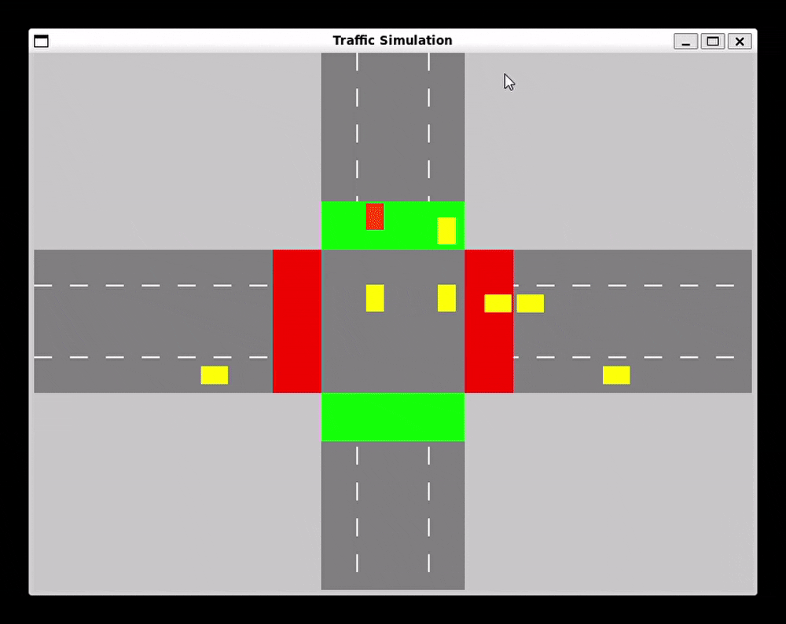

# Traffic Junction Simulation

## Overview  
This project simulates a traffic management system at a junction connecting four major roads (A, B, C, and D). Each road has three lanes with specific rules for vehicle movement, traffic lights, and priority management. The system uses queues to manage vehicle flow and priority lanes, aiming to solve real-world traffic issues through data structures.


---

## Features
- **Fair Vehicle Distribution:** Ensures equal dispatch from each lane under normal conditions.
- **Priority Management:** Prioritizes lanes with high waiting vehicles to reduce congestion.
- **Traffic Light Simulation:** Manages traffic flow using state-based lights (Red - Stop, Green - Go).
- **Queue Management:** Utilizes vehicle and priority lane queues to optimize traffic flow.
- **Real-time Visualization:** Simulates and visualizes vehicle movement at the junction.

---

## System Design

### Road and Lane Structure
- **Four Major Roads:** A, B, C, D.
- **Three Lanes per Road:**
  - **L1:** Incoming Lane
  - **L2:** Outgoing Lane (Priority Lane)
  - **L3:** Free Lane (Left Turn Only)

### Normal and Priority Lanes
- **Normal Lane:** Default state for all lanes unless declared as priority.
- **Priority Lane:** 
  - Lane AL2 is designated as a priority lane.
  - If more than 10 vehicles are waiting, this lane is served first until the count drops below 5.
  - Resumes normal condition when the vehicle count is less than 5.

### Traffic Lights
- **Four Traffic Lights** controlling opposite lanes.
- **States:**
  - **Red Light:** Stop
  - **Green Light:** Go Straight or Turn
- **Timing Calculation:**
  - The green light duration is calculated based on the average number of waiting vehicles.

### Vehicle and Lane Queues
- **Vehicle Queue:** Maintains vehicles for each road.
- **Lane/Light Priority Queue:** Manages lane priorities dynamically, especially for priority lane AL2.

---

## Algorithm
1. **Initialization:**
   - Set up vehicle queues for each road (A, B, C, D).
   - Initialize a priority queue for lane management.
2. **Traffic Light Management:**
   - Pair lights to control opposite lanes.
   - Calculate green light duration using:


3. **Vehicle Dispatching:**
   - Under normal conditions, serve vehicles equally from each lane.
   - Under high-priority conditions, serve priority lane (AL2) until vehicles < 5.
   - Resume normal condition afterward.
4. **Queue Management:**
   - Use a priority queue for lane management.
   - Update priority dynamically based on vehicle count in AL2.

---

## Project Structure

```
dsa-queue-generator
├── demo.gif
├── Makefile
├── README.md
└── src
    ├── generator.c
    ├── main.c
    ├── traffic_simulation.c
    └── traffic_simulation.h
```

---

## Installation
1. Clone the repository:
    ```bash
    git clone https://github.com/LORDSINE/dsa-queue-generator.git
    ```
2. Navigate to the project directory:
    ```bash
    cd dsa-queue-generator
    ```
3. Compile and run the simulation:
    ```bash
    make run
    ```

---

## Usage
1. Configure the number of vehicles for each lane in the input file.
2. Run the simulation to see how vehicles are managed at the junction.
3. Observe the priority changes and green light timings.

---

## Simulation Details
- **Normal Condition:** Vehicles are served equally across lanes.
- **High-Priority Condition:** Lane AL2 gets priority if more than 10 vehicles are waiting.
- **Free Lane:** L3 of each road is free and allowed to turn left without light conditions.
- **Visual Output:** The simulation displays vehicle movements and light states.

---

## Technologies Used
- **Programming Language:** C
- **Data Structure:** Queue, Priority Queue
- **Compiler:** gcc

---

## Contributing
Contributions are welcome! Feel free to open issues or submit pull requests.
1. Fork the repository.
2. Create a new branch:
    ```bash
    git checkout -b feature-branch-name
    ```
3. Make your changes and commit:
    ```bash
    git commit -m "Add your message here"
    ```
4. Push to the branch:
    ```bash
    git push origin feature-branch-name
    ```
5. Submit a pull request.

---

## Acknowledgements
- Kathmandu University for inspiring this project.
- Course instructors for guidance on queue management systems.
